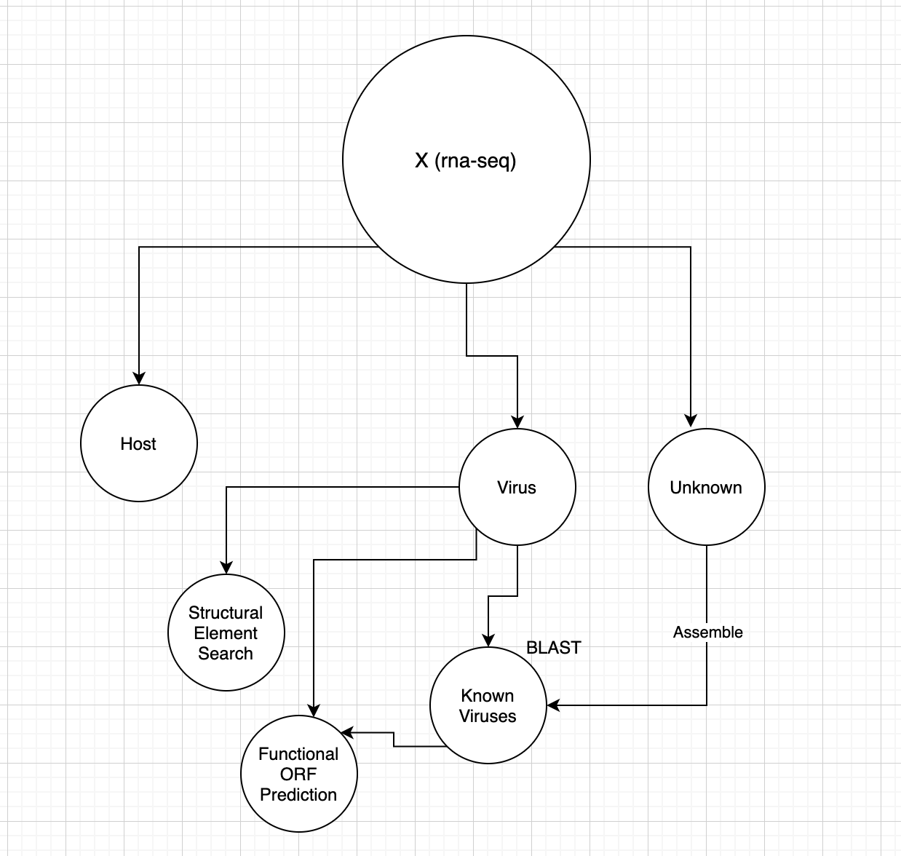

# 03-713, S21

## Pipeline
1. Filter RNA-seq data to remove host sequences
2. Assemble unknown sequences into contigs
3. BLAST virus sequences against known viruses
4. Predict functional ORFs in viral sequences
5. Search for structural elements in virus sequences
