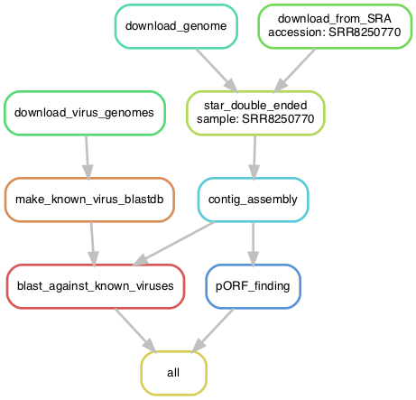

# Under The Hood

## Snakemake
We employ Snakemake to build a directed acyclic graph of tasks to execute stepwise.



## RNA-Seq Filtering: STAR

### Algorithm
### Snakemake Rule

## Contig Assembly: SPADES

### Algorithm
### Snakemake Rule

## Alignment to Known Viruses: BLASTn

### Algorithm
### Snakemake Rule

## Functional ORF Prediction: Orfipy

### Algorithm
Aho–Corasick string-searching:

1. Construct a trie out of input patterns.
2. Construct suffix and output links in Breadth First Order.
3. Use the constructed automata to traverse the string.
4. If current character matches any of children then follow it otherwise follow the suffix link.
5. At every node follow the output links to get patterns occurring till the current position.

Complexity:
- Trie Contruction: $O(n)$
- Suffix/Output Link Construction: $O(n)$
- Searching: $O(m + z)$
- Time Complexity: $O(n + m + z)$

Futher Reading:
- https://github.com/urmi-21/orfipy
- https://iq.opengenus.org/aho-corasick-algorithm
  
### Snakemake Rule

We output a final `.fasta` file per the Snakemake rule:
```
rule pORF_finding:
    input:
        "data/interim/{sample}_nonhost_contigs.fasta"
    output:
        "data/processed/{sample}_orf.fasta"
    conda:
        "envs/orfipy.yaml"
    shell:
        "orfipy {input} --rna {output} --min 10 --max 10000 --table 1 --outdir ."

```

## Structural Inference

### Algorithm
### Snakemake Rule
